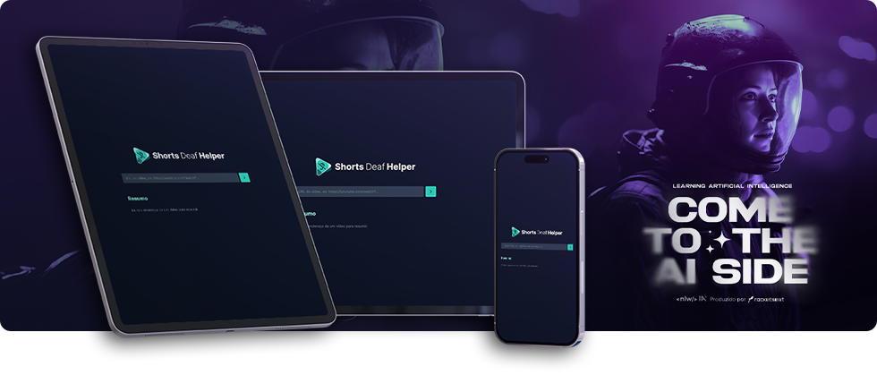

# Shorts Deaf Helper :: Full Stack Application



Aplicação desenvolvida durante a 13ª edição do NLW (Next Level Week), focada no desenvolvimento e integração com IA (Inteligência Artificial), realizada pela Rocketseat. Neste evento, realizei o desenvolvimento Full Stack de toda a aplicação, através de tecnologias como `HTML`, `CSS`, `Javascript`, `Node.js`, entre outras.

## Tecnologias utilizadas

`HTML` `CSS` `Javascript`

- **Biblitecas, pacotes e utilitários adicionais**
- `Axios` `Cors` `FFmpeg` `node-wav` `ytdl-core` `Lucide Icons`

## Como executar a aplicação

_Você deve ter o `Node.js` instalado. Caso não tenha, [clique aqui e faça a instalação](https://nodejs.org)._

- Clone este projeto, executando o seguinte comando:

> ```properties
> git clone https://github.com/julianosill/nlwia-foundations.git
> ```

- Entre na pasta do projeto e instale as dependências necessárias:

> ```properties
> cd nlwia-foundations
> npm i
> ```

- Após concluir a instalação, inicie seu servidor front-end local com:

> ```properties
> npm run web
> ```

- Abra uma segunda aba em seu terminal e inicie o servidor back-end com:

> ```properties
> npm run server
> ```

- Acesse a aplicação em [`http://localhost:5173`](http://localhost:5173) ou altere a porta, caso o terminal especifique outra.
